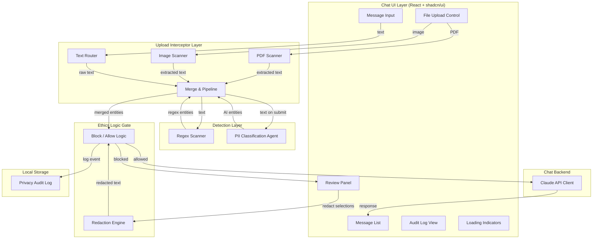

# Design Document — PrivacyLens

## Overview

PrivacyLens is a browser-based, privacy-first chat interface that intercepts all user-submitted content — text, images, and PDFs — before transmission to any AI backend. It runs a two-pass PII detection pipeline entirely on-device: a fast regex pass for structured patterns (SSN, email, phone, credit card, dates) and a deep semantic pass using the [openai/privacy-filter](https://huggingface.co/openai/privacy-filter) model via Transformers.js with WebGPU acceleration. When PII is detected, an Ethics Logic Gate hard-blocks the send action, presents a review panel with severity-coded highlights, and offers per-entity or bulk redaction. Only after explicit user approval does the message reach the Claude API backend. A local-only audit log tracks all detection and redaction events without ever transmitting PII externally.

The system is built with React 18, TypeScript, Vite, Tailwind CSS, and shadcn/ui. File processing uses pdfjs-dist for PDFs and Tesseract.js for image OCR. The chat backend communicates with Claude via the `@anthropic-ai/sdk`.

## Architecture

The system follows a layered pipeline architecture where each layer has a single responsibility and data flows unidirectionally from user input to AI backend.



### Key Architectural Decisions

1. **Client-side only detection**: All PII detection runs in the browser. No raw user content is sent to any server before explicit approval. This is the core privacy guarantee.

2. **Two-pass pipeline with different triggers**: The Regex Scanner runs on every input change (keystroke/paste) for instant feedback. The PII Classification Agent runs only on submit to avoid blocking the UI with model inference on every keystroke.

3. **Merge-before-gate**: Both detection passes produce entity lists that are merged (deduplicating overlapping spans, keeping higher confidence) before the Ethics Logic Gate evaluates them. This ensures the gate sees the complete picture.

4. **Hard block, not soft warning**: The Ethics Logic Gate disables the send button — it does not merely warn. This is a deliberate design choice to prevent accidental PII transmission.

5. **Stateless redaction**: The Redaction Engine is a pure function — it takes text and a list of entities to redact, and returns new text with placeholders. No side effects, no state mutation.

## Components and Interfaces

### 1. RegexScanner

Performs instant pattern-based PII detection using regular expressions.

```typescript
interface PIIEntity {
  text: string;
  category: PIICategory;
  start: number;
  end: number;
  confidence: number;
  source: "regex" | "ai";
}

type PIICategory =
  | "private_person"
  | "private_email"
  | "private_phone"
  | "private_address"
  | "private_date"
  | "private_url"
  | "account_number"
  | "secret";

interface RegexScanner {
  scan(text: string): PIIEntity[];
}
```

Patterns detected: SSN (`\d{3}-\d{2}-\d{4}`), email, phone numbers (US formats), dates (MM/DD/YYYY, YYYY-MM-DD, etc.), credit card numbers (Luhn-validated).

### 2. PIIClassificationAgent

Wraps the openai/privacy-filter model loaded via Transformers.js with WebGPU.

```typescript
type ModelStatus = "loading" | "ready" | "failed";

interface PIIClassificationAgent {
  status: ModelStatus;
  initialize(): Promise<void>;
  classify(text: string): Promise<PIIEntity[]>;
}
```

The agent uses the `pipeline("token-classification", "openai/privacy-filter", { device: "webgpu", dtype: "q4" })` API. It returns entities with the model's 8 categories, confidence scores, and character positions. On WebGPU unavailability or load failure, `status` becomes `"failed"` and the system falls back to regex-only mode.

### 3. UploadInterceptor

Orchestrates the two-pass detection pipeline and file processing.

```typescript
interface ScanResult {
  text: string;
  entities: PIIEntity[];
  source: "text" | "pdf" | "image";
}

interface UploadInterceptor {
  scanText(text: string): PIIEntity[];                    // regex only, instant
  scanOnSubmit(text: string): Promise<PIIEntity[]>;       // regex + AI, merged
  scanPDF(file: File): Promise<ScanResult>;
  scanImage(file: File): Promise<ScanResult>;
}
```

The `mergeEntities` internal function deduplicates overlapping spans from both passes. When two entities overlap, the one with the higher confidence score is kept. If they share the same span, they are merged into a single entity with the higher confidence.

### 4. PDFScanner

Extracts text from PDF files using pdfjs-dist.

```typescript
interface PDFScanner {
  extractText(file: File): Promise<string>;
}
```

Uses `pdfjs.getDocument()` to load the PDF, iterates all pages via `page.getTextContent()`, and concatenates text items into a single string.

### 5. ImageScanner

Extracts text from images using Tesseract.js OCR.

```typescript
interface ImageScanner {
  extractText(file: File): Promise<string>;
}
```

Accepts PNG, JPG, JPEG, and WebP files. Uses `Tesseract.recognize()` with the English language worker. Returns the extracted text string (may be empty if no text is found in the image).

### 6. EthicsLogicGate

The hard-blocking guardrail that controls message transmission.

```typescript
type GateStatus = "open" | "blocked";

interface GateState {
  status: GateStatus;
  entities: PIIEntity[];
  originalText: string;
  redactedText: string | null;
}

interface EthicsLogicGate {
  evaluate(text: string, entities: PIIEntity[]): GateState;
  approveRedacted(redactedText: string): void;
  overrideWithOriginal(): void;
}
```

When `entities.length > 0`, the gate enters `"blocked"` status. The send button is disabled. The gate transitions to `"open"` only when the user either approves a redacted version or explicitly overrides.

### 7. RedactionEngine

Pure function that replaces PII entities with category-specific placeholders.

```typescript
const PLACEHOLDER_MAP: Record<PIICategory, string> = {
  private_person: "[NAME]",
  private_email: "[EMAIL]",
  private_phone: "[PHONE]",
  private_address: "[ADDRESS]",
  private_date: "[DATE]",
  private_url: "[URL]",
  account_number: "[ACCOUNT_NUMBER]",
  secret: "[REDACTED]",
};

interface RedactionEngine {
  redact(text: string, entities: PIIEntity[]): string;
}
```

Entities are sorted by start position in reverse order and replaced from end to start to preserve character positions. Non-PII text is preserved unchanged.

### 8. ChatBackend

Communicates with the Claude API via the Anthropic SDK.

```typescript
interface ChatMessage {
  role: "user" | "assistant";
  content: string;
}

interface ChatBackend {
  sendMessage(
    message: string,
    history: ChatMessage[]
  ): Promise<string>;
}
```

Uses `@anthropic-ai/sdk` with `client.messages.create()`. Only the approved message content is transmitted — no PII metadata, redaction history, or audit data.

### 9. PrivacyAuditLog

Local-only audit log stored in browser localStorage.

```typescript
interface AuditEntry {
  timestamp: string;
  entityCount: number;
  categories: PIICategory[];
  action: "redact" | "auto-redact" | "override";
}

interface AuditSummary {
  totalEntitiesDetected: number;
  totalEntitiesProtected: number;
  entries: AuditEntry[];
}

interface PrivacyAuditLog {
  log(entry: AuditEntry): void;
  getSummary(): AuditSummary;
  getEntries(): AuditEntry[];
}
```

Stores only category labels and counts — never the actual PII text values. All data stays in `localStorage` and is never transmitted externally.

### 10. React UI Components

```
ChatPage
├── MessageList              # Scrollable chat history
│   ├── UserMessage          # User's sent message bubble
│   └── AssistantMessage     # Claude's response bubble
├── MessageInput             # Text input + file upload
│   ├── TextArea             # Message composition
│   ├── FileUploadButton     # PDF/image upload trigger
│   └── SendButton           # Disabled when gate is blocked
├── ReviewPanel              # Slides in when PII detected
│   ├── HighlightedText      # Message with inline PII highlights
│   ├── EntityList           # Per-entity redact toggles + severity badges
│   ├── AutoRedactButton     # "Auto-Redact All"
│   └── OverrideButton       # "Override — I understand the risk"
├── AuditLogPanel            # Privacy protection history
│   └── AuditSummary         # Total stats + entry list
├── ModelStatusIndicator     # Shows AI model loading/ready/fallback state
└── LoadingOverlay           # Shown during file scanning / AI inference
```

## Data Models

### PIIEntity

The core data structure representing a detected PII item.

```typescript
interface PIIEntity {
  id: string;                // Unique identifier (uuid)
  text: string;              // The matched PII text
  category: PIICategory;     // One of 8 PII categories
  start: number;             // Start character position in source text
  end: number;               // End character position in source text
  confidence: number;        // 0-1 confidence score
  source: "regex" | "ai";   // Which detection pass found it
  severity: "high" | "medium" | "low"; // Derived from category
}
```

Severity mapping:
- 🔴 High: `secret`, `account_number` (SSN, credit card fall here via regex → `account_number`/`secret`)
- 🟡 Medium: `private_person`, `private_address`
- 🟢 Low: `private_email`, `private_phone`, `private_date`, `private_url`

### ChatMessage

```typescript
interface ChatMessage {
  id: string;
  role: "user" | "assistant";
  content: string;
  timestamp: Date;
  wasRedacted: boolean;      // Whether this message went through redaction
  attachments?: FileAttachment[];
}

interface FileAttachment {
  name: string;
  type: "pdf" | "image";
  extractedText: string;
  entities: PIIEntity[];
}
```

### AuditEntry

```typescript
interface AuditEntry {
  id: string;
  timestamp: string;         // ISO 8601
  entityCount: number;
  categories: PIICategory[];
  action: "redact" | "auto-redact" | "override";
}
```

### Application State

```typescript
interface AppState {
  messages: ChatMessage[];
  currentInput: string;
  attachedFiles: FileAttachment[];
  gateState: GateState;
  modelStatus: ModelStatus;
  isScanning: boolean;
  auditLog: AuditEntry[];
}
```


## Correctness Properties

*A property is a characteristic or behavior that should hold true across all valid executions of a system — essentially, a formal statement about what the system should do. Properties serve as the bridge between human-readable specifications and machine-verifiable correctness guarantees.*

### Property 1: Regex scanner detection correctness

*For any* text string containing one or more embedded PII patterns (SSN, email, phone, date, credit card), the Regex Scanner SHALL return a list of entities where each entity contains the matched text equal to the substring at the reported `[start, end)` positions, a valid PII category, and a confidence of 1.0. Furthermore, every embedded PII pattern in the input SHALL have a corresponding entity in the output.

**Validates: Requirements 1.1, 1.2**

### Property 2: Entity merge deduplication

*For any* two lists of PII entities (one from the Regex Scanner, one from the PII Classification Agent) that contain overlapping spans covering the same text region, the merge function SHALL produce a unified list where no two entities overlap, and for each pair of overlapping input entities, the merged output retains the entity with the higher confidence score. The total number of unique text regions covered in the output SHALL equal the number of unique text regions covered across both inputs.

**Validates: Requirements 3.3, 3.4**

### Property 3: Ethics gate blocking invariant

*For any* text and entity list, the Ethics Logic Gate SHALL return a `"blocked"` status if and only if the entity list is non-empty, and SHALL return an `"open"` status if and only if the entity list is empty.

**Validates: Requirements 6.1, 6.4**

### Property 4: Ethics gate unblocking on review action

*For any* gate in `"blocked"` state with a non-empty entity list, performing any one of the three review actions (redact selected entities, auto-redact all, or override) SHALL transition the gate to `"open"` status.

**Validates: Requirements 6.3**

### Property 5: Severity category mapping

*For any* valid PII category, the severity mapping function SHALL return `"high"` for `account_number` and `secret`, `"medium"` for `private_person` and `private_address`, and `"low"` for `private_email`, `private_phone`, `private_date`, and `private_url`. The mapping SHALL be total — every one of the 8 categories maps to exactly one severity level.

**Validates: Requirements 7.2**

### Property 6: Redaction correctness

*For any* text string and any subset of PII entities with valid non-overlapping `[start, end)` positions within that text, the Redaction Engine SHALL produce an output where (a) each selected entity's text is replaced by its category-specific placeholder token, and (b) all characters outside the entity spans are preserved in their original order and content.

**Validates: Requirements 8.1, 8.2, 8.3**

### Property 7: Redaction round-trip — no PII survives redaction

*For any* text string, if the Regex Scanner detects a set of PII entities and the Redaction Engine redacts all of them, then re-scanning the redacted output with the Regex Scanner SHALL produce zero PII detections at the positions where entities were previously found. The placeholder tokens themselves SHALL NOT be detected as PII.

**Validates: Requirements 8.4**

### Property 8: Audit log integrity — no PII text leaks into log

*For any* PII detection event with arbitrary entity texts, categories, and counts, the audit log entry produced SHALL contain the timestamp, entity count, list of categories, and user action — but SHALL NOT contain any of the original entity text values. Serializing the audit entry to JSON and searching for any of the original entity texts SHALL yield zero matches.

**Validates: Requirements 10.1, 10.4**

### Property 9: Audit summary aggregation

*For any* sequence of audit log entries with varying entity counts, the summary's `totalEntitiesDetected` SHALL equal the sum of all `entityCount` values across all entries, and `totalEntitiesProtected` SHALL equal the sum of `entityCount` values for entries where the action is `"redact"` or `"auto-redact"` (not `"override"`).

**Validates: Requirements 10.3**

## Error Handling

### File Processing Errors

| Error | Component | Behavior |
|---|---|---|
| PDF parse failure | PDFScanner | Display error toast: "Could not process this PDF file." Do not send any content. Do not crash the app. |
| Image OCR failure | ImageScanner | Display error toast: "Could not process this image." Do not send any content. Do not crash the app. |
| Unsupported file type | FileUploadControl | Reject at the file input level via `accept` attribute. If bypassed, display error: "Unsupported file type." |
| Empty PDF (no text) | PDFScanner | Return empty string. Pipeline proceeds with empty text — no PII detected, gate stays open. |
| Empty image (no text) | ImageScanner | Return empty string. Zero entities reported. Content proceeds without gate block (Req 5.4). |

### Model Errors

| Error | Component | Behavior |
|---|---|---|
| WebGPU unavailable | PIIClassificationAgent | Set status to `"failed"`. Fall back to regex-only mode. Display notice in UI (Req 2.4). |
| Model download failure | PIIClassificationAgent | Set status to `"failed"`. Fall back to regex-only mode. Display notice (Req 12.4). |
| Model inference error | PIIClassificationAgent | Catch error, log to console. Fall back to regex-only results for this message. Display transient warning. |
| Model timeout | PIIClassificationAgent | After 30s, abort inference. Use regex-only results. Display warning. |

### API Errors

| Error | Component | Behavior |
|---|---|---|
| Claude API error (4xx/5xx) | ChatBackend | Display error message in chat: "Failed to get a response. Please try again." Retain user's message for retry (Req 9.3). |
| Network failure | ChatBackend | Display error: "Network error. Check your connection." Retain message for retry. |
| API key missing/invalid | ChatBackend | Display error on app load: "API key not configured." Disable send entirely. |

### State Errors

| Error | Component | Behavior |
|---|---|---|
| localStorage full | PrivacyAuditLog | Catch quota error. Log warning to console. Continue without logging this entry. Do not block the user flow. |
| localStorage unavailable | PrivacyAuditLog | Detect on init. Disable audit log feature. Display notice: "Audit log unavailable in this browser." |
| Corrupt audit log data | PrivacyAuditLog | Catch JSON parse error. Reset log to empty array. Display notice: "Audit log was reset." |

## Testing Strategy

### Property-Based Tests (fast-check)

Property-based tests use [fast-check](https://github.com/dubzzz/fast-check) with a minimum of 100 iterations per property. Each test is tagged with its design property reference.

| Property | Test Description | Generator Strategy |
|---|---|---|
| P1: Regex detection | Generate strings with embedded PII patterns at random positions | Custom arbitrary: random text + injected SSN/email/phone/date/CC patterns |
| P2: Entity merge | Generate two entity lists with controlled overlaps | Arbitrary pairs of entity lists with random confidence scores and overlapping spans |
| P3: Gate blocking | Generate random entity lists (empty and non-empty) | `fc.array(entityArbitrary)` — test both empty and non-empty cases |
| P4: Gate unblocking | Generate blocked gate states + random review actions | `fc.record` for gate state + `fc.constantFrom("redact", "auto-redact", "override")` |
| P5: Severity mapping | Enumerate all 8 categories | `fc.constantFrom(...allCategories)` — exhaustive over the finite domain |
| P6: Redaction correctness | Generate text with non-overlapping entity spans | Custom arbitrary: random text + random non-overlapping `[start, end)` ranges with random categories |
| P7: Redaction round-trip | Generate text with PII patterns, scan, redact, re-scan | Reuse P1 generator, chain through scan → redact → re-scan |
| P8: Audit log integrity | Generate PII events with random entity texts | `fc.record` with `fc.string()` for entity texts, verify none appear in log entry |
| P9: Audit summary | Generate sequences of audit entries with random counts | `fc.array(fc.record({ entityCount: fc.nat(), action: fc.constantFrom(...) }))` |

Tag format: `// Feature: privacy-lens, Property {N}: {title}`

### Unit Tests (Vitest)

Unit tests cover specific examples, edge cases, and integration points:

- **RegexScanner**: Empty string returns empty list. Single SSN detection. Multiple mixed patterns. Partial matches (e.g., "123-45" is not an SSN). Credit card Luhn validation.
- **RedactionEngine**: Single entity redaction. Multiple adjacent entities. Entity at start/end of string. Placeholder token correctness per category.
- **EthicsLogicGate**: State transitions: open → blocked → open. Override flow. Redact flow. Auto-redact flow.
- **PIIClassificationAgent**: Mock model output parsing. Category validation. Fallback mode activation.
- **PrivacyAuditLog**: Entry creation. Summary computation. localStorage read/write. Corrupt data recovery.
- **Severity mapping**: All 8 categories map correctly. No unmapped categories.

### Integration Tests

- **Two-pass pipeline end-to-end**: Text with PII → regex scan → AI scan (mocked) → merge → gate blocks → redact → gate opens → send.
- **PDF flow**: Upload PDF → extract text → scan → review → redact → send.
- **Image flow**: Upload image → OCR → scan → review → redact → send.
- **Chat flow**: Send approved message → Claude API (mocked) → response displayed.
- **Fallback mode**: WebGPU unavailable → regex-only mode → UI notice.

### Component Tests (React Testing Library)

- **ReviewPanel**: Renders highlighted entities. Severity badges match categories. Toggle controls work. Auto-redact selects all. Override requires confirmation.
- **MessageInput**: File upload accepts correct types. Send button disabled when gate blocked. Loading indicator during scan.
- **AuditLogPanel**: Displays summary stats. Lists entries chronologically.
- **ModelStatusIndicator**: Shows loading/ready/fallback states correctly.
