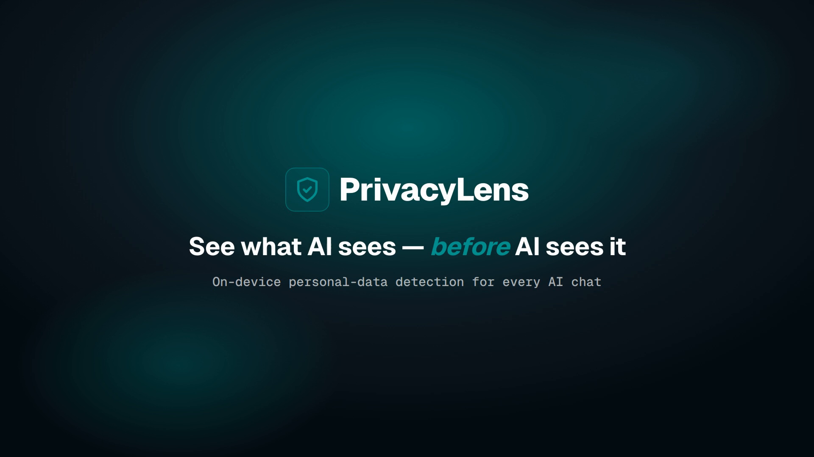
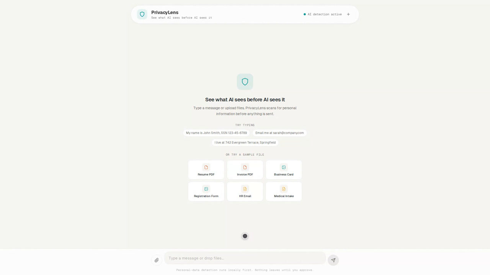
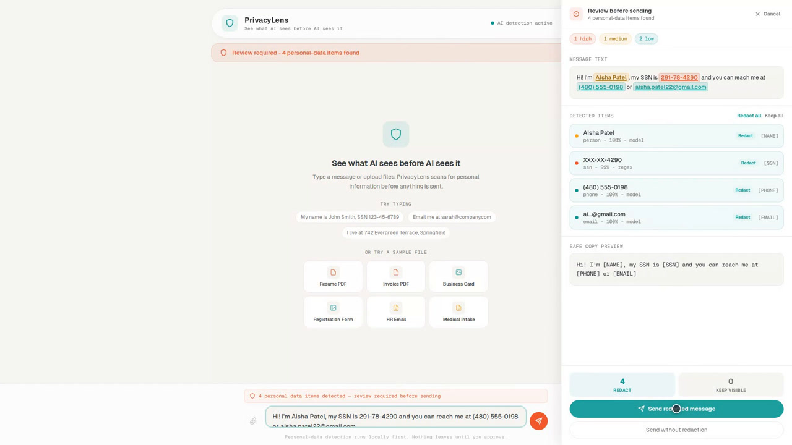
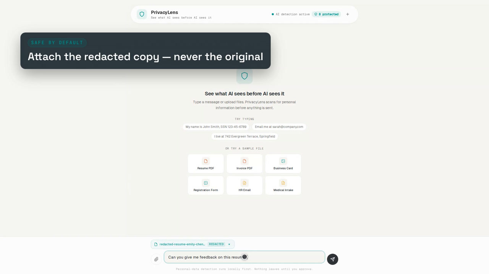
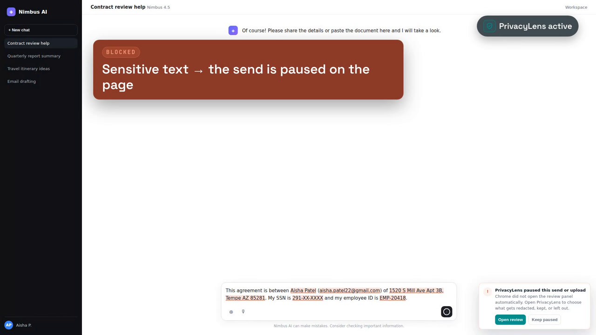
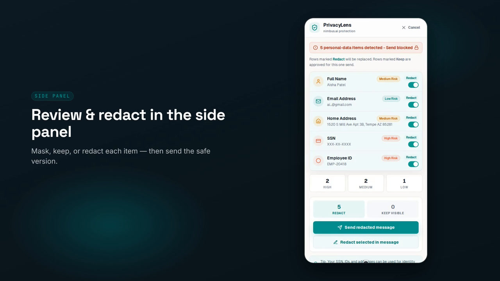
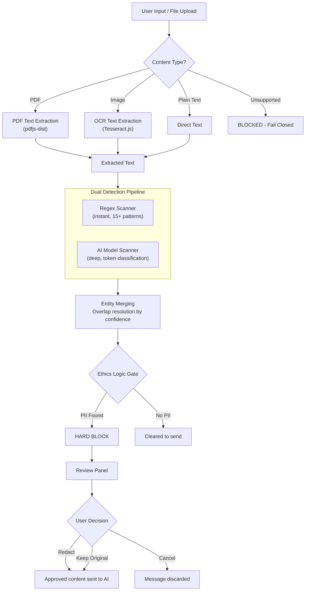

# :shield: PrivacyLens

**See what AI sees before AI sees it.**

A privacy-first browser extension and web app that intercepts content before it reaches AI services, detects PII locally using an on-device AI model, and hard-blocks sending until you explicitly approve what's shared.


## Demo

**▶ [Play the 72-second demo video](https://github.com/shitijkarsolia/privacylens/raw/main/demo-video/privacylens-demo.mp4)** — real-time
text detection and the ethics gate, PDF/image redaction with before/after, the
Chrome extension blocking a send on a live AI chat, and the side-panel review.

[](https://github.com/shitijkarsolia/privacylens/raw/main/demo-video/privacylens-demo.mp4)

The video is built reproducibly with [HyperFrames](https://github.com/heygen-com/hyperframes)
motion graphics composited over real screen-recordings of the app — see
[demo-video/README.md](demo-video/README.md).

## Screenshots

| Local demo home | Review gate |
|---|---|
|  |  |

| Redacted file flow | Extension send block |
|---|---|
|  |  |



### Try it yourself

```bash
npm install && npm run build && npm run server
# Open http://localhost:3001/demo  — works with or without an API key
```

## Overview

PrivacyLens prevents personal information from leaking into AI chat services by scanning all content locally before it can be sent. It combines instant regex pattern matching with a deep AI model (openai/privacy-filter, 1.5B sparse MoE) running entirely in-browser via Transformers.js. **Nothing leaves your browser until you explicitly approve it.**

## Problem Statement

Millions of people paste sensitive data into AI chatbots daily - resumes with SSNs, medical records, financial documents, code with API keys. PII leakage to cloud AI services is a real and growing concern, with no undo button once data is sent. No existing tool provides a **real-time, in-browser, hard-blocking** solution that catches content before it leaves your device.

## Solution

PrivacyLens takes a fundamentally different approach:

- **Runs entirely in the browser** - no cloud dependency for PII detection
- **Hard ethics gate** - not a warning, not a dismissible dialog; sending is blocked until you decide
- **Multi-format support** - scans text, PDFs, and images before they reach any AI service
- **Works everywhere** - Chrome extension intercepts input on ChatGPT, Claude, Gemini, Perplexity, and Copilot

## Key Features

- **Real-time PII detection** across 11 categories (names, SSNs, emails, credit cards, API keys, and more)
- **On-device AI model** - openai/privacy-filter (1.5B total params, 50M active per token via sparse MoE)
- **Ethics Logic Gate** - hard block on detected PII, not a soft warning
- **Multi-format scanning** - text, PDF via pdfjs-dist, images via Tesseract.js OCR
- **Visual before/after comparison** for redacted files
- **Chrome extension** with side panel review workflow
- **Dual detection pipeline** - instant regex feedback + deep AI model on submit
- **Fail-closed** - unsupported or unreadable files are blocked by default

## Architecture

The system uses a dual-pipeline detection architecture: a fast regex scanner provides instant keystroke-level feedback, while a deep AI model performs semantic analysis on submit. Both results are merged through confidence-weighted overlap resolution before reaching the ethics gate.



For full architecture documentation including system overview and Chrome extension diagrams, see [docs/ARCHITECTURE.md](docs/ARCHITECTURE.md).

## Tech Stack

| Layer | Technology |
|-------|------------|
| Framework | React 18 + TypeScript + Vite |
| Styling | Tailwind CSS v4 + Framer Motion |
| PII Detection | openai/privacy-filter via Transformers.js (in-browser) |
| PDF Parsing | pdfjs-dist |
| Image OCR | Tesseract.js (in-browser) |
| Visual Redaction | Canvas API |
| Chat Backend | Claude API via Anthropic SDK |
| API Server | Express + tsx |
| Extension | Chrome MV3 (content script + side panel) |
| Testing | Playwright |

## How It Works

### Text

1. User types a message in any AI chat composer
2. Regex scanner provides instant highlighting on each keystroke
3. On submit, the AI model performs deep token classification
4. Both results are merged; any detected PII triggers the ethics gate and blocks sending

### PDF

1. `pdfjs-dist` extracts text from all pages without OCR
2. Extracted text enters the dual detection pipeline
3. If PII is found, a visual before/after comparison shows what will be redacted
4. User attaches the redacted copy or cancels the upload

### Image

1. `Tesseract.js` runs OCR entirely in-browser to extract visible text
2. Extracted text enters the dual detection pipeline
3. Canvas API generates a visually redacted version (blacked-out PII regions)
4. User reviews and decides whether to attach the sanitized copy

## The Ethics Logic Gate

This is a **hard gate** in the code - not a suggestion, not a warning, not a dismissible dialog.

The gate in [`src/lib/ethics-gate.ts`](src/lib/ethics-gate.ts) implements a simple rule: if `entities.length > 0`, the message is **blocked from being sent**. The send button is disabled. The send pipeline is halted. There is no "dismiss" or "remind me later."

The user must explicitly review each detected entity and choose to redact it, keep it with acknowledgment, or cancel the message entirely. Override requires a second confirmation step.

**Why this design?** Privacy should be opt-in, not opt-out. The default state is protection. Users must take deliberate action to share personal information - never the other way around.

## Getting Started

### Prerequisites

- Node.js 18+
- npm

### Quick Start

```bash
npm install
npm run build
npm run server
# Open http://localhost:3001  (landing)
# Open http://localhost:3001/demo  (live chat demo)
```

The server runs **with or without** an Anthropic API key:

- **With `ANTHROPIC_API_KEY`** set, the in-app chat talks to Claude.
- **Without a key**, chat replies come from a clearly labeled built-in demo
  assistant, so the whole flow (detection, the ethics gate, redaction,
  before/after previews) is fully explorable out of the box.

```bash
# Optional: enable live Claude responses
ANTHROPIC_API_KEY=your-key npm run server
```

### Shareable static build (no server)

The demo also runs as a fully static site with **zero backend** — PII
detection falls back to the instant pattern scanner (plus the in-browser
WebGPU model where available), and chat uses the local demo assistant.
Nothing leaves the browser.

```bash
npm run build:pages   # builds dist/ for static hosting + 404 SPA fallback + extension zip
# Deploy dist/ to GitHub Pages, Netlify, Vercel static, etc.
```

A GitHub Actions workflow (`.github/workflows/deploy-pages.yml`) publishes
the demo to GitHub Pages on every push to `main`.

### Development Mode

```bash
# Terminal 1: API server
ANTHROPIC_API_KEY=your-key npm run server

# Terminal 2: Vite dev server with HMR
npm run dev
# Open http://localhost:5173
```

### Chrome Extension

After building, load the extension from the `dist/` directory:

```bash
npm run build
# Chrome -> chrome://extensions -> Developer mode -> Load unpacked -> select ./dist
```

For detailed installation steps, see [docs/INSTALL_EXTENSION.md](docs/INSTALL_EXTENSION.md).

## Documentation

Full technical documentation lives in [`docs/`](docs/):

| Doc | What's inside |
|---|---|
| [ARCHITECTURE.md](docs/ARCHITECTURE.md) | System design, the three detection tiers, runtime modes, data-flow diagrams |
| [MODELS.md](docs/MODELS.md) | Every model used, where each runs, fallbacks, sizes, how to swap them |
| [API.md](docs/API.md) | `/api/scan`, `/api/chat`, `/api/model-status` request/response reference |
| [DEPLOYMENT.md](docs/DEPLOYMENT.md) | Hosting (full-stack, static, **Vercel/Netlify/Pages**) + **extension distribution** |
| [DEVELOPMENT.md](docs/DEVELOPMENT.md) | All npm/helper scripts, repo map, testing, sample files |
| [INSTALL_EXTENSION.md](docs/INSTALL_EXTENSION.md) | Step-by-step extension install |
| [EXTENSION_STATUS.md](docs/EXTENSION_STATUS.md) | Extension capabilities, verification log, known limits |
| [demo-video/README.md](demo-video/README.md) | How the demo video is recorded and rendered (HyperFrames + ffmpeg) |

## Project Structure

```
src/
  components/    # React UI (chat, review panel, landing, install)
  hooks/         # useModelLoader (detection tiers), usePIIDetection, useChat
  lib/           # Detection, redaction, chat fallback, base-path routing
  extension/     # Chrome extension source (model + file scanners, side panel)
public/
  extension/     # Chrome MV3 scripts (content script, background)
  samples/       # Demo sample files (PDFs, images, text) with planted PII
  tesseract/     # Self-hosted OCR runtime (generated at build time)
scripts/         # Build, package, QA, test, and demo-video tooling
docs/            # Technical documentation (see index above)
demo-video/      # Demo video pipeline + rendered MP4
server.ts        # Express API server (Claude proxy + PII scan + status)
```

A complete file-by-file map is in [docs/DEVELOPMENT.md](docs/DEVELOPMENT.md#repository-map).

## Design Decisions & Tradeoffs

**Local-first vs. cloud detection.** Running inference in the browser adds complexity (model download, WASM performance) but ensures no content ever touches a server before the user approves. The privacy guarantee is architectural, not policy-based.

**Hard gate vs. soft warning.** Most privacy tools show a warning that users click through. PrivacyLens physically blocks the send pipeline. This is intentionally more aggressive because data leakage is irreversible - you cannot un-send a message to an AI service.

**Sparse MoE model (1.5B/50M active).** The openai/privacy-filter model uses 128 experts with top-4 routing, keeping only ~50M parameters active per token. This makes deep semantic PII detection feasible in-browser without requiring a GPU or unreasonable load times.

**Regex + model dual pipeline.** Regex provides instant feedback (sub-millisecond) while the model catches semantic PII that patterns miss (contextual names, implied personal details). Running both in parallel gives responsive UX without sacrificing detection depth.

**Fail-closed for unsupported files.** Files that cannot be scanned (unknown format, corrupted, too large) are blocked by default rather than passed through. This prevents data leakage through formats the scanner cannot analyze.

## Privacy Guarantees

- All PII detection runs **locally in the browser** using an on-device AI model
- No data leaves the device until the user explicitly approves
- Model is cached in the browser after first download - no re-download needed
- The server only receives approved or redacted content
- File processing (PDF parsing, OCR) is entirely client-side
- No telemetry, no analytics, no tracking
- All personal data in `public/samples/` and the test scripts is **synthetic** (fictional names, SSNs, addresses, emails) — see [SECURITY.md](SECURITY.md)

## Built With

- [openai/privacy-filter](https://huggingface.co/openai/privacy-filter) - Apache 2.0 licensed PII detection model
- [Transformers.js](https://github.com/huggingface/transformers.js) by Hugging Face - in-browser ML inference
- [pdfjs-dist](https://mozilla.github.io/pdf.js/) - PDF text extraction
- [Tesseract.js](https://github.com/naptha/tesseract.js) - In-browser OCR

Built for the **Kiro Spark Challenge** (Ethics frame).
