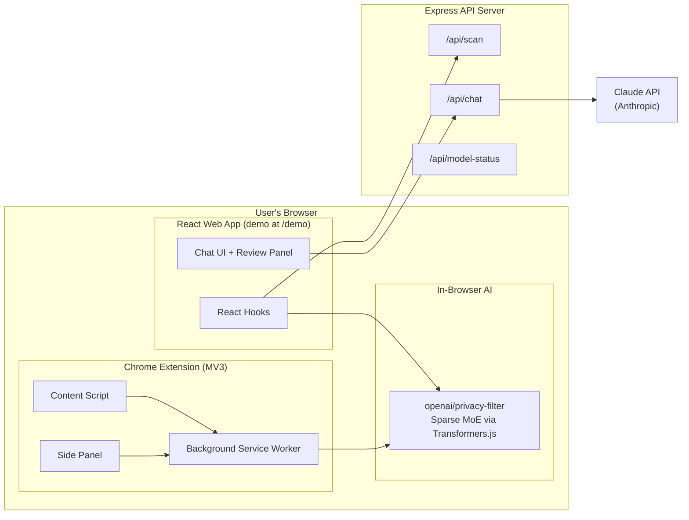
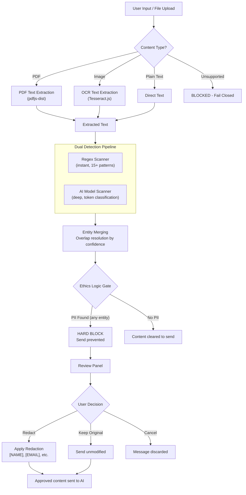
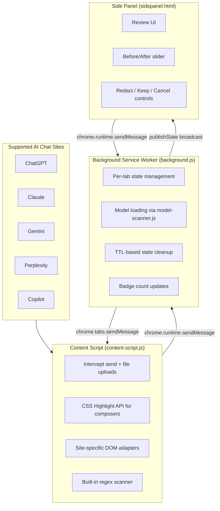

# PrivacyLens Architecture

PrivacyLens is a local-first PII detection and redaction system that prevents personal information from leaking into AI chat services. It runs entirely in the browser using a sparse MoE model (openai/privacy-filter via Transformers.js) combined with regex-based pattern matching, and provides both a standalone web demo and a Chrome extension that intercepts input on popular AI chat sites.

## System Overview

## PII Detection Pipeline

## Chrome Extension Architecture

## Data Flow by Content Type

### Text Messages

Direct text input follows the shortest path through the pipeline:

1. User types in composer (web app input or AI chat site composer)
2. **Instant feedback**: `scanWithRegex()` runs on every keystroke with debouncing, highlighting detected PII in real-time
3. **Deep scan on submit**: `runDetectionPipeline()` runs both regex and AI model classification
4. Entities are merged with overlap resolution (higher confidence wins)
5. Ethics gate evaluates: any entity triggers a hard block

Key files: [`src/lib/regex-scanner.ts`](../src/lib/regex-scanner.ts), [`src/lib/upload-interceptor.ts`](../src/lib/upload-interceptor.ts), [`src/lib/ethics-gate.ts`](../src/lib/ethics-gate.ts)

### PDF Files

1. File intercepted on upload (extension) or selected in web app
2. `pdfjs-dist` extracts text from all pages
3. Extracted text enters the same dual detection pipeline
4. If PII found, a redacted text version is generated for the user to review

Key files: [`src/lib/pdf-scanner.ts`](../src/lib/pdf-scanner.ts), [`src/extension/file-scanner.ts`](../src/extension/file-scanner.ts)

### Images

1. File intercepted on upload (extension) or selected in web app
2. `Tesseract.js` performs OCR to extract visible text
3. Extracted text enters the dual detection pipeline
4. Visual redaction via canvas overlay is available for image content

Key files: [`src/lib/image-scanner.ts`](../src/lib/image-scanner.ts), [`src/lib/visual-obfuscator.ts`](../src/lib/visual-obfuscator.ts), [`src/extension/file-scanner.ts`](../src/extension/file-scanner.ts)

## Key Design Decisions

### Local-First Processing

All PII detection runs entirely in the browser. The AI model (`openai/privacy-filter`) is downloaded once and cached locally. No user content is sent to any server until the user explicitly approves it. The Express server's `/api/scan` endpoint exists as an optional fallback but the primary path is fully client-side.

### Hard Gate, Not Soft Warning

The ethics gate in [`src/lib/ethics-gate.ts`](../src/lib/ethics-gate.ts) implements a hard block: if *any* PII entity is detected (`entities.length > 0`), the message is blocked from being sent. This is not a dismissible warning. The user must explicitly choose to redact, keep, or cancel before content can proceed.

### Sparse MoE Model

The `openai/privacy-filter` model has 1.5B total parameters but uses a Sparse Mixture-of-Experts architecture where only ~50M parameters are active per token. This provides deep semantic PII detection (catching context-dependent names, implied references) while remaining fast enough for in-browser inference via Transformers.js with ONNX/WASM backend.

### Fail-Closed for Unsupported Files

Files that cannot be scanned (unsupported format, too large, or unreadable) are blocked by default rather than passed through. The content script explicitly categorizes these as "unsupported" or "unscannable" and prevents upload until the user acknowledges the risk. This prevents data leakage through file types the scanner cannot analyze.

### Dual Pipeline: Regex + AI Model

The detection system runs two complementary scanners:

- **Regex scanner** ([`src/lib/regex-scanner.ts`](../src/lib/regex-scanner.ts)): Provides instant feedback with 15+ patterns covering SSNs, emails, phone numbers, credit cards, API keys, and more. Runs synchronously on every keystroke.
- **AI model scanner** ([`src/extension/model-scanner.ts`](../src/extension/model-scanner.ts)): Provides deep semantic analysis via token classification. Catches PII that regex misses (contextual names, implied personal details). Runs asynchronously on submit.

Results from both are merged in [`src/lib/upload-interceptor.ts`](../src/lib/upload-interceptor.ts) using confidence-weighted overlap resolution, ensuring no entity is missed while avoiding duplicates.
