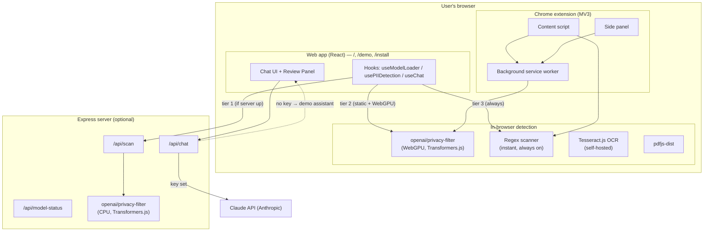
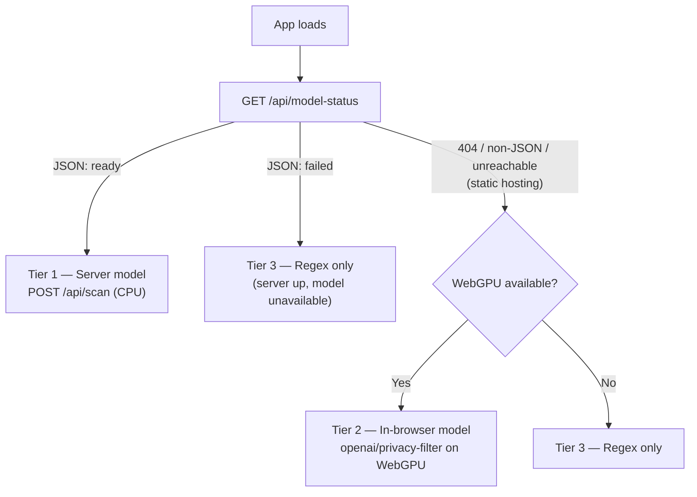
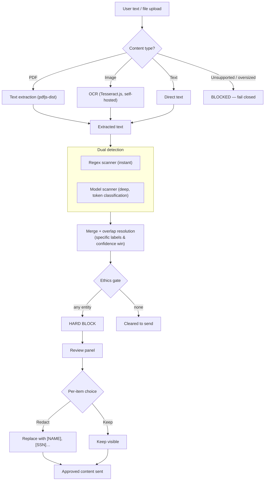
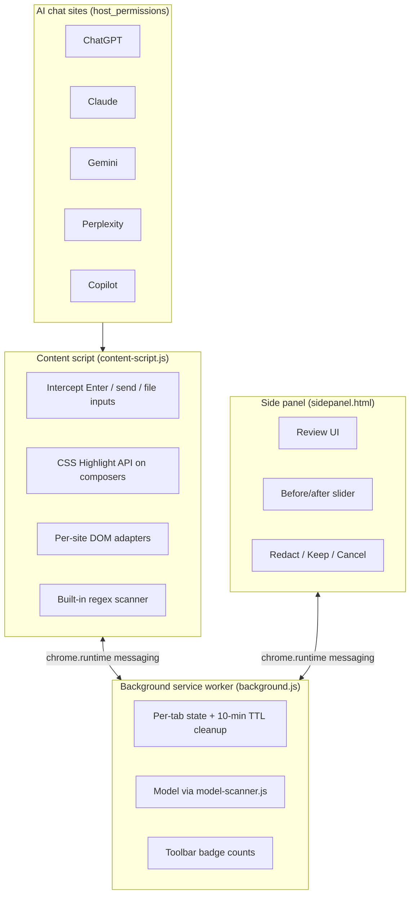

# PrivacyLens Architecture

PrivacyLens is a **local-first** PII detection and redaction layer that stops
personal information from leaking into AI chat services. It detects personal
data in text, PDFs, and images, then **hard-blocks** the send until the user
reviews and redacts. It ships in two forms that share one detection engine:

- a **web app** — a landing page, an interactive chat **demo** (`/demo`), and an
  **install** page (`/install`); and
- a **Chrome extension (MV3)** that intercepts input on ChatGPT, Claude, Gemini,
  Perplexity, and Copilot.

> New here? Read this file for the design, then:
> [MODELS.md](MODELS.md) (what AI runs where) ·
> [API.md](API.md) (server endpoints) ·
> [DEPLOYMENT.md](DEPLOYMENT.md) (hosting + extension distribution) ·
> [DEVELOPMENT.md](DEVELOPMENT.md) (scripts, repo map, testing).

---

## System overview

The web app and the extension never send content anywhere until the user
approves it. The Express server is **optional** — see *Runtime modes* below.

---

## Detection runs in tiers (graceful degradation)

The web app resolves which detector to use at load time and **degrades
gracefully** so the app is always usable. Source:
[`src/hooks/useModelLoader.ts`](../src/hooks/useModelLoader.ts).

| Tier | Detector | When it's chosen | Status chip |
|---|---|---|---|
| 1 | **Server model** — `openai/privacy-filter` on CPU via `/api/scan` | `/api/model-status` returns `ready` | "AI detection active" |
| 2 | **In-browser model** — `openai/privacy-filter` on WebGPU | No backend (static host) **and** WebGPU present | "On-device AI detection active" |
| 3 | **Regex only** — 15+ pattern scanner | No backend & no WebGPU, or the model failed to load | "Pattern detection active" |

The **regex scanner always runs** (instant, on every keystroke) regardless of
tier; tiers 1–2 add a deep semantic pass that is merged on top. The ethics gate
enforces identically in every tier, so privacy protection never silently
weakens — at worst it falls back to instant pattern matching.

---

## Runtime modes (how it's deployed)

| Mode | What's running | Detection | Chat |
|---|---|---|---|
| **Full stack** | `npm run server` serving `dist/` + the 3 API routes | Tier 1 (server CPU model) | Claude if `ANTHROPIC_API_KEY` set, else demo assistant |
| **Static** (Pages / Vercel / Netlify) | `dist/` only, no backend | Tier 2 (WebGPU) or Tier 3 (regex) | Demo assistant (or add a serverless `/api/chat` for Claude) |
| **Extension** | MV3 extension installed in the browser | In-browser model + regex (no server) | N/A — guards the host site's own chat |

Both the detector tier and the chat backend **fall back automatically** — the
same build runs in all three modes. See [DEPLOYMENT.md](DEPLOYMENT.md).

---

## PII detection pipeline

**Entity merging** ([`src/lib/upload-interceptor.ts`](../src/lib/upload-interceptor.ts))
resolves overlaps by *specificity then confidence* — e.g. the regex `ssn` label
wins over the model's generic `account_number` for the same digits.

Key files: [`regex-scanner.ts`](../src/lib/regex-scanner.ts),
[`upload-interceptor.ts`](../src/lib/upload-interceptor.ts),
[`ethics-gate.ts`](../src/lib/ethics-gate.ts),
[`model-entities.ts`](../src/lib/model-entities.ts) (shared model→entity mapping
used by both the server and the in-browser model).

---

## Chat with graceful fallback

The demo's chat ([`src/lib/chat-api.ts`](../src/lib/chat-api.ts)) calls
`/api/chat` and falls back to a **local demo assistant**
([`src/lib/demo-assistant.ts`](../src/lib/demo-assistant.ts)) whenever the
backend is missing, keyless, or errors. Demo replies are **clearly labeled** in
the UI and acknowledge how many items the user redacted, so the full
detect → block → redact → send loop is explorable with no key and no server.

---

## Chrome extension architecture

The extension is **100% local** — it makes no `/api` or server calls. File
scanning (PDF/OCR) and the model both run inside the extension; the OCR runtime
is bundled at `dist/tesseract/`. Detail and status:
[EXTENSION_STATUS.md](EXTENSION_STATUS.md), install:
[INSTALL_EXTENSION.md](INSTALL_EXTENSION.md).

---

## Key design decisions

- **Hard gate, not a warning.** Any detected entity blocks the send
  ([`ethics-gate.ts`](../src/lib/ethics-gate.ts) — `blocked = entities.length > 0`).
  The user must redact, keep, or cancel; the block is not dismissible.
- **Local-first & provable.** No content leaves the browser until approval. The
  static demo is tested to make **zero external network requests**
  ([`scripts/test-static-demo.mjs`](../scripts/test-static-demo.mjs)).
- **Self-hosted assets.** Fonts and the Tesseract OCR runtime are vendored, so
  even asset loads don't hit third-party CDNs.
- **Fail-closed files.** Unsupported / oversized / unreadable files are blocked,
  not passed through.
- **Sparse-MoE model.** `openai/privacy-filter` is 1.5B params but ~50M active
  per token (MoE), giving deep semantic detection at in-browser speeds. See
  [MODELS.md](MODELS.md).
- **One build, three modes.** Detector tier and chat backend both degrade
  gracefully, so the same artifact runs full-stack, static, or as an extension.
